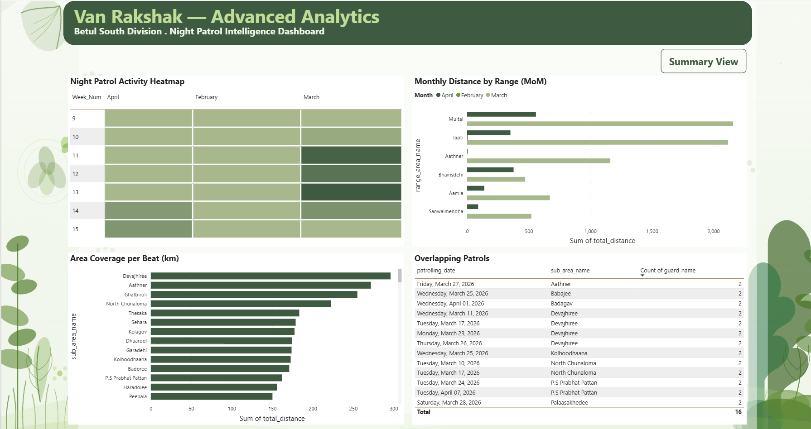
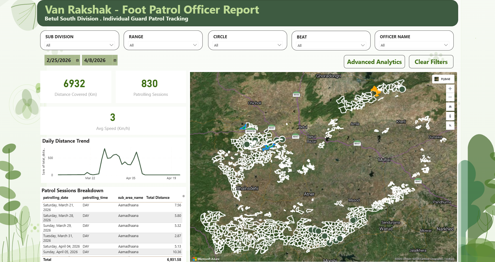

# 🌿 Van Rakshak — Forest Surveillance Analytics Platform


> **AI-powered, cloud-native patrolling and surveillance analytics system for the Madhya Pradesh Forest Department (Betul South Division)**

Built during my internship at **Intra Techno Solutions Pvt. Ltd. (ITS India)** as a Jr. Data Engineer.

---

## 📌 Project Overview

Van Rakshak is an enterprise analytics platform that digitizes and analyzes forest patrol data for the **Betul South Division, Madhya Pradesh Forest Department**. The system tracks patrol routes, officer performance, beat coverage, and night surveillance — replacing manual reporting with real-time AI-powered dashboards.

### Key Features
- 📊 **6 standalone Power BI reports** with role-based access control
- 🌙 **Day + Night patrol analytics** with separate data pipelines
- 🔖 **Bookmark-based navigation** for designation-level filtering
- 📈 **Advanced Analytics pages** with MoM comparison, heatmaps, and overlap detection
- 🗺️ **Azure Maps satellite view** showing real patrol routes
- ☁️ **Azure Synapse Analytics** as the data lakehouse backend
- 🔒 **Shared Dataset / Thin Report architecture** for zero data duplication

---

## 🏗️ System Architecture

```
Mobile App (Android)
        │
        ▼
FastAPI REST API (SQLAlchemy ORM)
        │
        ├──► Azure SQL / PostgreSQL (Relational data)
        ├──► Azure Blob Storage (.kml patrol tracks)
        └──► Azure Synapse Analytics (Parquet — Data Lakehouse)
                        │
                        ▼
              Star Schema Views (vw_sb_*)
              ┌─────────────────────────┐
              │  vw_sb_dim_date         │
              │  vw_sb_dim_guard        │
              │  vw_sb_dim_patrol       │
              │  vw_sb_patrol_all       │
              │  vw_sb_patrol_night     │
              │  vw_sb_patrol_route     │
              └─────────────────────────┘
                        │
                        ▼
        VanRakshak_MasterDataset.pbix
        [Single Shared Semantic Model]
        [OAuth2 · Scheduled Refresh · RLS]
                        │
        ┌───────────────┼───────────────┐
        ▼               ▼               ▼
  Patrolling      Night Patrol    Foot Patrol
  Summary         Summary         Officer Report
        │               │               │
        ▼               ▼               ▼
  Data Extractor  Night Data      Landing Page
                  Extractor
```

---

## 📁 Repository Structure

```
van-rakshak-analytics/
│
├── README.md                          ← You are here
│
├── docs/
│   ├── architecture.md                ← Full system architecture
│   ├── power-bi-setup.md              ← Power BI setup guide
│   ├── dax-guide.md                   ← DAX measures documentation
│   ├── rbac-design.md                 ← RBAC & workspace design
│   └── report-inventory.md            ← All 6 reports overview
│
├── dax-measures/
│   ├── mom-distance-change.dax        ← MoM % Change (Day)
│   ├── mom-night-distance-change.dax  ← MoM % Change (Night)
│   ├── overlapping-patrols.dax        ← Overlap detection
│   └── avg-distance-per-beat.dax      ← Beat coverage average
│
├── themes/
│   ├── VanRakshak_Theme_Light.json    ← Light theme (used in reports)
│   └── VanRakshak_Theme_Earthy.json   ← Earthy forest theme
│
├── design-system/
│   ├── design-system.md               ← Colors, fonts, components
│   └── background.svg                 ← Botanical background SVG
│
├── screenshots/
│   ├── 01-patrolling-summary.png
│   ├── 02-night-patrolling-summary.png
│   ├── 03-foot-patrol-officer.png
│   ├── 04-night-patrol-officer.png
│   ├── 05-patrolling-data-extractor.png
│   ├── 06-night-data-extractor.png
│   ├── 07-advanced-analytics-heatmap.png
│   ├── 08-advanced-analytics-mom.png
│   └── 09-advanced-analytics-overlaps.png
│
└── .github/
    └── CONTRIBUTING.md
```

---

## 📊 Power BI Reports

All reports follow a **Shared Dataset / Thin Report** architecture — a single master semantic model published to Power BI Service with individual thin reports connecting via live connection.

| Report | Data Source | Key Features |
|--------|-------------|--------------|
| Patrolling Summary | `vw_sb_patrol_all` | Range/beat KPIs, donut charts, heatmap, bookmarks |
| Night Patrolling Summary | `vw_sb_patrol_night` | Night shift metrics, 5 bookmark filters |
| Foot Patrol Officer | `vw_sb_patrol_all` + `vw_sb_patrol_route` | Azure Maps satellite, individual officer tracking |
| Night Patrol Officer | `vw_sb_patrol_night` + `vw_sb_patrol_route` | Night route map, officer-level drill-down |
| Patrolling Data Extractor | `vw_sb_patrol_all` | Raw data export, designation bookmarks |
| Night Patrolling Data Extractor | `vw_sb_patrol_night` | Night records export, advanced analytics |

### Advanced Analytics (Page 2 — all reports)
Every report has a second page with:
- 🔥 **Activity Heatmap** — Week × Month with green gradient intensity
- 📊 **MoM Comparison** — Side-by-side bars per range across months
- 📍 **Area Coverage per Beat** — Sorted bar chart showing km per P.S
- ⚠️ **Overlapping Patrols** — Same beat, same day, multiple officers

---

## 🧮 DAX Measures

Four custom DAX measures written and published to the master dataset:

```dax
-- Month-over-Month Distance % Change (Day Patrol)
MoM Distance % Change =
VAR CurrentMonth = CALCULATE(
    SUM(vw_sb_patrol_all[total_distance]),
    DATESMTD(vw_sb_dim_date[calendar_date])
)
VAR LastMonth = CALCULATE(
    SUM(vw_sb_patrol_all[total_distance]),
    DATEADD(DATESMTD(vw_sb_dim_date[calendar_date]), -1, MONTH)
)
RETURN DIVIDE(CurrentMonth - LastMonth, LastMonth, 0)
```

See [`dax-measures/`](./dax-measures/) for all 4 measures with full documentation.

---

## 🎨 Design System

| Element | Value |
|---------|-------|
| Primary Green | `#1D6B3A` |
| Accent Lime | `#C0DD97` |
| Light Background | `#EAF3DE` |
| Dark Forest | `#1D3D2A` |
| Teal Highlight | `#9FE1CB` |
| Alert Red | `#C0392B` |
| Font | Arial / Segoe UI |
| Border Radius | 8–10px |
| Background | Botanical SVG wallpaper |

---

## 🛠️ Tech Stack

| Layer | Technology |
|-------|-----------|
| Mobile App | Android (Java/Kotlin) |
| Backend API | FastAPI (Python) + SQLAlchemy ORM |
| Admin Interface | Django Admin |
| Database | Azure SQL / PostgreSQL |
| File Storage | Azure Blob Storage (.kml tracks) |
| Data Lakehouse | Azure Synapse Analytics (Parquet) |
| Analytics | Power BI Desktop + Power BI Service |
| Data Model | Star Schema (vw_sb_* views) |
| Authentication | OAuth2 (Azure AD) |
| Maps | Azure Maps (satellite patrol routes) |

---

## 🔐 RBAC Architecture

```
VanRakshak-SharedDataset Workspace
└── VanRakshak_MasterDataset
    ├── Build Permission → All report consumer groups
    └── RLS Roles → Division-level data isolation

VR-Workspace-Patrolling   → Forest Rangers (Viewer)
VR-Workspace-NightPatrol  → Night Shift Team (Viewer)
VR-Workspace-DataExtract  → Analysts (Viewer)
VR-Workspace-Officers     → Field Officers (Viewer)
```

---

## 🚀 Getting Started

### Prerequisites
- Power BI Desktop (latest version)
- Power BI Pro or Premium Per User license
- Azure Synapse Analytics access
- Azure AD organizational account

### Setup Steps

1. **Clone this repository**
```bash
git clone https://github.com/yourusername/van-rakshak-analytics.git
```

2. **Publish Master Dataset**
   - Open `VanRakshak_MasterDataset.pbix` in Power BI Desktop
   - Go to `Home → Publish → VanRakshak-SharedDataset workspace`
   - Configure gateway connection with OAuth2

3. **Connect Thin Reports**
   - Open any report `.pbix` file
   - `Get Data → Power BI Datasets → VanRakshak_MasterDataset`
   - All visuals will connect automatically via live connection

4. **Apply Theme**
   - `View → Themes → Browse for themes`
   - Select `themes/VanRakshak_Theme_Light.json`

5. **Configure RBAC**
   - See [`docs/rbac-design.md`](./docs/rbac-design.md) for workspace and permission setup

---

## 📸 Screenshots

### Patrolling Summary — Summary View


### Night Patrolling — Advanced Analytics


### Foot Patrol Officer — Azure Maps


---

## 👨‍💻 Author

**Inderjot Singh Matharoo**
- 🎓 B.Tech Computer Science Engineering, MIT ADT University Pune
- 💼 Jr. Data Engineer Intern, Intra Techno Solutions Pvt. Ltd.
- 🔗 [LinkedIn](https://www.linkedin.com/in/inderjotsingh25/)
- 📧 inderjot@intratechnosolutions.com

---

## 🏢 Organization

**Intra Techno Solutions Pvt. Ltd. (ITS India)**
Built for: **Madhya Pradesh Forest Department — Betul South Division**
Mentor: **Pankaj Lal** (Lead Data Engineer)

---

## ⚠️ Disclaimer

This repository contains documentation, DAX measures, Power BI themes, and design assets only. No actual forest patrol data, credentials, or proprietary company code is included. All data shown in screenshots is real operational data used with permission for academic/portfolio purposes.

---

## 📄 License

This project is for portfolio and academic purposes. All rights to the Van Rakshak platform belong to Intra Techno Solutions Pvt. Ltd. and the Madhya Pradesh Forest Department.

---

*Built with 🌿 for forest conservation — Van Rakshak means "Forest Guardian" in Hindi*
